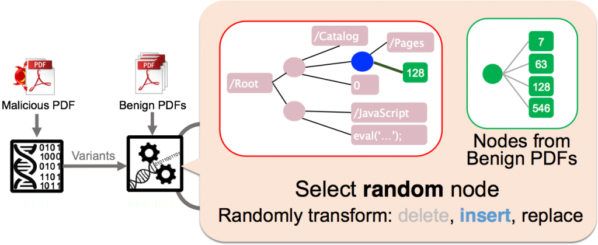
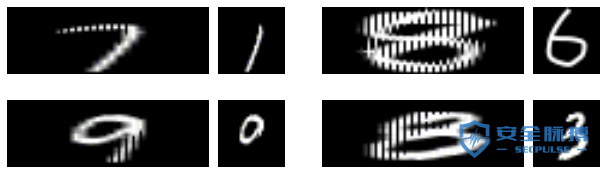

# AI安全风险白皮书
360 安全研究院在过去一年里对深度学习系统的安全性做了详细的研究。 我们通过这个文档对这些工作做了一个系统的总结。 AI系统的安全问题主要包括模型安全、数据安全以及代码安全。 本文以目前流行的图像识别AI系统为例，介绍AI系统在这些方面面临的安全威胁。对于这些威胁造成的影响，我们关注传统的攻击类型，包括恶意输入导致的拒绝服务，信息泄露，系统劫持。 同时我们也关注AI系统特有的安全问题，例如逃逸攻击，数据污染攻击。

关于AI系统的安全威胁，本文从以下三个角度进行阐述。第一部分描述深度学习系统软件实现的复杂度，以及软件实现带来的安全漏洞。第二部分描述针对深度学习系统模型的逃逸攻击。 第三部分揭示深度学习系统数据流中的安全威胁，以及相应的降维攻击展示。 白皮书主要内容参照了360安全团队近期发布的AI安全相关报告。

## I.深度学习软件实现中的安全问题 
人工智能应用面临来自多个方面的威胁：包括深度学习框架中的软件实现漏洞、对抗机器学习的恶意样本生成、训练数据的污染等等。 这些威胁可能导致人工智能所驱动的识别系统出现混乱，形成漏判或者误判，甚至导致系统崩溃或被劫持，并可以使智能设备变成僵尸攻击工具。

在推进人工智能应用的同时，我们迫切需要关注并解决这些安全问题。本章首先介绍我们在深度学习框架中发现的安全问题。

### 1. 人工智能讨论中的安全盲点
目前公众对人工智能的关注，尤其是深度学习方面， 缺少对安全的考虑。我们把这个现象称为人工智能的安全盲点。 导致这个盲点的主要原因是由于算法与实现的距离。 近期对于深度学习的讨论主要停留在算法和前景展望的层面，对应用场景和程序输入有很多假设。

受到关注的应用往往假定处于善意的或封闭的场景。例如高准确率的语音识别中的输入都是自然采集而成，图片识别中的输入也都来自正常拍摄的照片。这些讨论没有考虑人为恶意构造或合成的场景。

人工智能讨论中的安全盲点可以通过最典型的手写数字识别案例来说明。基于MNIST数据集的手写数字识别应用是深度学习的一个非常典型的例子， 最新的深度学习教程几乎都采用这个应用作为实例演示。在这些教程中（如下图所示）算法层的讨论所考虑的分类结果只关心特定类别的近似度和置信概率区间。算法层的讨论没有考虑输入会导致程序崩溃甚至被攻击者劫持控制流。这其中被忽略掉的输出结果反映出算法和实现上考虑问题的差距，也就是目前人工智能讨论中的安全盲点。

现实中的开放应用需要处理的输入不仅来源于正常用户，也可以是来自黑产等恶意用户。 人工智能的应用必须考虑到应用所面临的现实威胁。程序设计人员需要考虑输入数据是否可控，监测程序是否正常执行，并验证程序执行结果是否真实反映应用的本来目的。

### 2. 深度学习系统的实现及依赖复杂度
深度学习软件很多是实现在深度学习框架上。目前基于深度学习系统框架非常多，主流的包括TensorFlow、Torch，以及Caffe 等。

深度学习框架的使用可以让应用开发人员无需关心神经元网络分层以及培训分类的实现细节，更多关注应用本身的业务逻辑。 开发人员可以在框架上直接构建自己的神经元网络模型，并利用框架提供的接口对模型进行训练。这些框架简化了深度学习应用的设计和开发难度，一个深度学习的模型可以用几十行代码就可以写出来。

深度学习框架掩盖了它所使用的组件依赖，同时也隐藏了系统的复杂程度。 每种深度学习框架又都是实现在众多基础库和组件之上，很多深度学习框架里还包括图像处理、矩阵计算、数据处理、GPU加速等功能。 图2展示了典型的深度学习应用组件和它们的依赖关系。例如Caffe除了自身神经元网络模块实现以外，还包括137个第三方动态库，例如libprotobuf, libopencv, libz 等。 谷歌的TensorFlow 框架也包含对多达97个python模块的依赖，包括librosa,numpy 等。

系统越复杂，就越有可能包含安全隐患。任何在深度学习框架以及它所依赖的组件中的安全问题都会威胁到框架之上的应用系统。另外模块往往来自不同的开发者，对模块间的接口经常有不同的理解。当这种不一致导致安全问题时，模块开发者甚至会认为是其它模块调用不符合规范而不是自己的问题。在我们的发现的导致深度学习框架崩溃的漏洞中就遇到过这种情况。

### 3. 深度学习软件实现细节中的安全问题
正如安全人员常说的， 魔鬼隐藏于细节之中 （The Devil is In the Detail）。任何一个大型软件系统都会有实现漏洞。 考虑到深度学习框架的复杂性， 深度学习应用也不例外。

360 Team Seri0us 团队在一个月的时间里面发现了数十个深度学习框架及其依赖库中的软件漏洞。发现的漏洞包括了几乎所有常见的类型，例如内存访问越界，空指针引用，整数溢出，除零异常等。 这些漏洞潜在带来的危害可以导致对深度学习应用的拒绝服务攻击，控制流劫持，分类逃逸，以及潜在的数据污染攻击。

以下我们通过两个简单的例子来介绍深度学习框架中的漏洞以及对应用的影响。两个例子都来源于框架的依赖库，一个是TensorFlow框架所依赖的numpy包，另一个是Caffe在处理图像识别所使用的libjasper库。

- **案例1： 对基于TensorFlow的语音识别应用进行拒绝服务攻击**

案例中的 numpy 是TensorFlow所依赖的一个负责科学计算的python库。TensorFlow的很多应用在进行矩阵运算的时候都会用的它。 我们在这个库里发现一个简单逻辑漏洞（CVE-2017-12852）。 这个问题的简单情况如下图所示，它是发生在numpy中的pad函数。 在pad函数中，存在这样一个while循环，循环结束需要使 pad_before>safe_pad和pad_after>safe_pad同时不成立， 而在我们构造的例子中，可以使得pad_before和 pad_after不断的增大，而safe_pad不断的减小，使得循环始终无法结束，从而导致拒绝服务。

我们选择了基于TensorFlow的语音识别应用来演示基于这个漏洞触发的攻击。攻击者通过构造语音文件，会导致上图中显示的循环无法结束，使应用程序长时间占用CPU而不返回结果，从而导致拒绝服务攻击。

我们选取了一个基于TensoFlow进行声音分类的应用来演示这个问题。这个应用是一个 TensorFlow程序演示，应用脚本源码可以从以下网站下载：[ “Urban Sound Classification”：  https://aqibsaeed.github.io/2016-09-03-urban-sound-classification-part-1/  ]

当给定一个正常的狗叫的音频文件，应用可以识别声音内容为 "dog bark"，其过程如下：

当给定一个畸形的声音文件可导致拒绝服务， 程序无法正常结束：

在前面关于模块依赖复杂导致漏洞的讨论中，我们提到过对模块接口的理解不一致会导致问题。值得一提的是Numpy这个漏洞的修复过程正好反映了这个问题。在我们最初通知Numpy开发者的时候，他们认为问题是由于调用者librosa库的开发人员没有对数据进行严格检测，导致空列表的使用。所以尽管有应用会因为此问题受到拒绝服务攻击， Numpy开发者最初认为不需要修复这个问题。但后来发现有多个其它库对numpy的相关函数也有频繁的类似调用，所以最终对这个漏洞进行了修复。同时 librosa 开发者也对相关调用添加了输入检查。

- **案例2：恶意图片导致基于Caffe的图像识别应用出现内存访问越界**
很多深度学习的应用是在图像和视觉处理领域。我们发现当使用深度学习框架Caffe来进行图片识别时，Caffe会依赖libjasper等图像视觉库来处理输入。 libjasper对图像进行识别处理时，如果存在漏洞，例如内存越界，就可能导致整个应用程序出现崩溃，甚至数据流被篡改。下面的例子是用展示的是用Caffe所自带的例子图像识别程序来处理我们提供的畸形图片所出现的崩溃场景。

当利用Caffe来对正常图片进行分类时，正常的使用情况如下：

当利用Caffe来对恶意图片进行分类时，程序出现崩溃：

以上仅仅是我们发现的众多问题中的两个展示。 360 Team Seri0s 团队已发现并公布了数十个导致深度学习框架出现问题的漏洞，其中包含已对外公开的15个CVE。 在上个月举行的ISC安全大会上，Team Seri0s成员已经展示了六个攻击实例。更多细节请参考ISC 2017大会人工智能与安全论坛所发布的内容。

### 4. 小结
本章节的目的是介绍被大众所忽视的人工智能安全问题，**尤其是深度学习软件实现中的漏洞以及可能造成的隐患**。目前在媒体中展示的深度学习应用中，许多并不与外界直接交互，例如AlphaGo；或者是在封闭的环境下工作，例如通过用户行为日志对用户分类画像并进行异常检测。这些系统的攻击面相对较小，它们并不容易受到本文中所提到的漏洞的直接影响。 但是随着人工智能应用的普及，安全威胁会不断增加。 更多的应用会把应用的输入接口直接或简介暴露出来。同时封闭系统的攻击面也会随着时间和环境而转化。 另外除了传统的基于软件漏洞的攻击，深度学习还面临对抗神经元网络以及其它各种逃逸攻击。

## II. 深度学习模型相关的安全问题 
深度学习引领着新一轮的人工智能浪潮。 在受到全社会广泛关注的同时，**人工智能应用也面临来自多个方面的威胁：包括深度学习框架中的软件实现漏洞、对抗机器学习的恶意样本生成、训练数据的污染等等。** 这些威胁可能导致人工智能所驱动的识别系统出现混乱，形成漏判或者误判，甚至导致系统崩溃或被劫持，并可以使智能设备变成僵尸攻击工具。在推进人工智能应用的同时，我们迫切需要关注并解决这些安全问题。本文介绍在深度学习逃逸方面的一些实例和研究工作。

### 1. 逃逸攻击简介
逃逸是指攻击者在不改变目标机器学习系统的情况下，通过构造特定输入样本以完成欺骗目标系统的攻击。例如，攻击者可以修改一个恶意软件样本的非关键特征，使得它被一个反病毒系统判定为良性样本，从而绕过检测。攻击者为实施逃逸攻击而特意构造的样本通常被称为“对抗样本”。只要一个机器学习模型没有完美地学到判别规则，攻击者就有可能构造对抗样本用以欺骗机器学习系统。例如，研究者一直试图在计算机上模仿人类视觉功能，但由于人类视觉机理过于复杂，两个系统在判别物体时依赖的规则存在一定差异。对抗图片恰好利用这些差异使得机器学习模型得出和人类视觉截然不同的结果，如图1所示[1]。

一个著名的逃逸样本是Ian Goodfellow[2]在2015年ICLR会议上用过的熊猫与长臂猿分类的例子。 被攻击目标是一个来谷歌的深度学习研究系统。该系统利用卷积神经元网络能够精确区分熊猫与长臂猿等图片。但是攻击者可以对熊猫图片增加少量干扰，生成的图片对人来讲仍然可以清晰地判断为熊猫，但深度学习系统会误认为长臂猿。 图2显示了熊猫原图以及经过扰动生成后的图片。

下面我们从攻击者的角度介绍如何系统生成对抗样本来达到稳定的逃逸攻击。不关心技术细节的读者可忽略这些内容，直接跳到文章结尾的总结部分。

### 2. 基于机器学习的对抗样本生成
基于机器学习的逃逸攻击可分为白盒攻击和黑盒攻击。白盒攻击需要获取机器学习模型内部的所有信息，然后直接计算得到对抗样本；黑盒攻击则只需要知道模型的输入和输出，通过观察模型输出的变化来生成对抗样本。

#### 2.1白盒攻击
深度神经网络是数学上可微的模型，在训练过程中通常使用反向传播算法得到每层的梯度来调整网络参数。假设神经网络的输入是X，类别标签是Y， 网络参数是W，输出是F(X)=W*X。训练神经网络时，对于每个确定的输入样本X，我们反复调整网络参数W使得输出值F(X)趋向于该样本的类别标签Y。白盒攻击使用同样的方法，区别只是我们固定网络参数W，反复修改输入样本X使得输出值F(X)趋向于攻击目标Y’。这意味着我们只需要修改目标函数以及约束条件，就可以使用与训练神经网络同样的方法计算得到对抗性样本。

白盒攻击的约束条件是一个关键部分。从X起始求解X’使得F(X’)=Y’的过程中，我们必须保证X’的标签不是Y’。例如，对于一个手写体输入“1”，如果我们把它改成“2”使得模型判别是“2”，那就不算是攻击。在计算机视觉领域，我们不太可能使用人力判定攻击方法生成的每一个样本X’，因此引入了距离函数Δ(X, X’)。我们假设在一定的距离内，X’的 含义和标签与X是一致的。距离函数可以选择不同的Norm来表示，比如L2, L∞, 和L0 。

L-BFGS是第一种攻击深度学习模型的方法，它使用L2-Norm限制X’的范围，并使用最优化方法L-BFGS计算得到X’。后来基于模型的线性假设，研究者又提出了Fast Gradient Sign Method (FGSM)[3] 和DeepFool[4]等一些新方法。如果以距离Δ(X, X’)最小为目标，目前最先进的方法是Carlini-Wagner，它分别对多种距离函数做了求解优化。

### 2.2 黑盒攻击
黑盒攻击只依赖于机器学习模型的输出，而不需要了解模型内部的构造和状态。遗传（进化）算法即是一个有效的黑盒攻击方法。

遗传算法是在计算机上模仿达尔文生物进化论的一种最优化求解方法。它主要分为两个过程：首先通过基因突变或杂交得到新一代的变种，然后以优胜劣汰的方式选择优势变种。这个过程可以周而复始，一代一代地演化，最终得到我们需要的样本。

把遗传算法用于黑盒逃逸攻击时，我们利用模型的输出给每一个变种打分，F(X’)越接近目标标签Y’则得分越高，把高分变种留下来继续演化，最终可以得到F(X’)=Y’。这种方法已经成功用于欺骗基于机器学习的计算机视觉模型以及恶意软件检测器。

## 3.基于遗传算法的对抗样本生成
### 3.1 对Gmail PDF过滤的逃逸攻击
本文合作者许伟林一年前在NDSS大会上发表了名为Automatically Evading Classifiers的论文[5]。研究工作采用遗传编程（Genetic Programming）随机修改恶意软件的方法，成功攻击了两个号称准确率极高的恶意PDF文件分类器：PDFrate 和Hidost 。这些逃逸检测的恶意文件都是算法自动修改出来的，并不需要PDF安全专家介入。图3显示了对抗样本生成的基本流程。

同样的算法可以用来对实际应用的机器学习系统进行逃逸攻击。上面提到的工作可以对 Gmail内嵌的恶意软件分类器进行攻击， 并且只须4行代码修改已知恶意PDF样本就可以达到近50%的逃逸率，10亿Gmail用户都受到影响。

### 3.2 利用Fuzzing测试的对抗样本生成
除了对模型和算法的弱点进行分析，黑盒攻击还可以借鉴模糊测试的方法来实现对抗样本的生成。下面以手写数字图像识别为例，我们的目标是产生对抗图片，使其看起来是“1”，而人工智能系统却识别为“2”。我们的主要思路是将这样一个对抗样本生成的问题，转换为一个漏洞挖掘的问题，如下图4所示。

我们主要是利用灰盒fuzzing测试的方法来实现，首先给定数字“1”的图片作为种子，然后通过对种子图片进行变异，如果机器学习系统将变异后的图片识别为“2”，那么我们认为这样一个图片就是对抗样本。

利用Fuzzing测试的对抗样本生成是基于AFL来实现的，主要做了以下几方面的改进：

1.  是漏洞注入，我们在机器学习系统中添加一个判断，当图片被识别为2时，则人为产生一个crash；

2.  是在数据变异的过程中，我们考虑文件格式的内容，优先对一些图像内容相关的数据进行变异；

3.  是在AFL已有的路径导向的基础上，增加一些关键数据的导向。

下图5是我们生成的一些对抗样本的例子。

基于Fuzzing测试的对抗样本生成方法也可以快速的应用到其他AI应用系统中，如人脸识别系统。

## 4. 基于软件漏洞进行逃逸攻击
针对AI系统的对抗性攻击，就是让人工智能系统输出错误的结果。 还是以手写图像识别为例，攻击者可以构造恶意的图片，使得人工智能系统在分类识别图片的过程中触发相应的安全漏洞， 改变程序正常执行的控制流或数据流，使得人工智能系统输出攻击者指定的结果。 攻击思路基本分为两种：

1. 基于数据流篡改可以利用任意写内存漏洞，直接将AI系统中的一些关键数据进行修改(如标签、索引等)， 使得AI系统输出错误的结果。 2. 另一种则是通过常规的控制流劫持(如堆溢出、栈溢出等漏洞)来完成对抗攻击，由于控制流劫持漏洞可以通过漏洞实现任意代码的执行，因此必然可以控制AI系统输出攻击者预期的结果。

关于软件漏洞造成的问题我们在第一章里已有详细介绍。 这里只做了一个简单介绍, 更多细节请参考ISC 2017大会人工智能与安全论坛所发布的内容

## 5. 小结
本文的目的是继续介绍被大众所忽视的人工智能安全问题。虽然深度学习在处理自然生成的语音图像等以达到相当高的准确率，但是对恶意构造的输入仍然有巨大的提升空间。虽然深度学习系统经过训练可以对正常输入达到很低的误判率，但是当攻击者用系统化的方法能够生成误判样本的时候，攻击的效率就可以接近100%， 从而实现稳定的逃逸攻击。 随着人工智能应用的普及，相信对逃逸攻击的研究也会越来越深入。

# III. 深度学习数据流处理中的安全风险 
深度学习在很多领域受到广泛关注。 尤其在图形图像领域里，人脸识别和自动驾驶等应用正在逐渐进入我们的生活。 深度学习的流行与普及也自然带来了安全方面的考虑。 目前对深度学习的安全讨论包括深度学习平台中发现的漏洞，深度学习模型中隐藏的错误，还有对深度学习系统的逃逸攻击。

360 安全团队发现在深度学习的数据处理流程中，同样存在安全风险。攻击者在不利用平台软件实现漏洞或机器学习模型弱点的情况下，只利用深度学习数据流中的处理问题，就可以实现逃逸或数据污染攻击。

## 1. 攻击实例
以深度学习图片识别应用为攻击目标， 我们用几个例子来介绍降维攻击的效果。先从一张图片开始。下面这个图应该是羊群的照片吧。 我们把这张图片送到深度学习图片识别应用程序里，看看深度学习系统会怎么说。

这里我们用的程序来自Caffe平台自带的经典图片识别应用例子，识别所用的神经元网络是由谷歌发布的GoogleNet，数据来自著名的ImageNet 比赛，模型是由伯克利用谷歌的模型加上ImageNet的数据培训的。这个平台的识别能力大家没有疑问吧。

Caffe的深度学习应用认为上面的图片是 狼 ！ （图片识别程序输出如下。 TensorFlow 的例子结果也是狼！）

再看一个例子。 下面这张图，还是羊，人来看应该是一只小羊。

那么在机器学习系统里它会被认成什么呢？ Caffe的机器学习应用会把这一张认为是猫，具体讲属于ImageNet里的猞猁猫！其它平台TensorFlow，Torch等流行的图片识别应用也是这样。

为什么会是这样？ 深度学习的训练模型没有错。问题出在深度学习应用的数据流处理上。

## 2. 降维攻击原理
我们在前一段时间讨论过关于深度学习的逃逸攻击，主要介绍了各种让机器学习系统做出错误判别的方法。 **目前学术界对深度学习逃逸攻击的研究大多集中在对抗样本生成的方法，通过各种算法在图片上生成扰动，从而导致深度学习系统的误判。 这篇文章提到的降维攻击没有使用传统的对抗样本生成策略。 降维攻击是对深度学习应用的数据流处理进行了攻击。**

深度学习系统的核心是神经元网络。 深度学习所使用的静态神经元网络往往假定它的输入是一个固定的维度，这样便于设计深度神经元网络。 固定的维度带来的问题是：实际的输入并不一定与神经元网络模型输入用相同的维度。 解决这种维度不匹配的方法有两个，一个是要求所有的输入都必须是模型使用的维度，其它输入一概扔掉。 另外一个选择是对输入进行维度调整。对于试图对广泛图片进行识别的应用里，大多采用了第二种方法。在具体图像识别应用里，就是把大的输入图片进行维度缩减，小的图片进行维度放大。

下图为一个典型的深度学习应用的数据流处理过程。

**维度变化的结果是，深度学习模型真正用到的数据是维度变化过的图片。**

维度变化的算法有很多种，常用的包括最近点抽取，双线性插值等。这些算法的目的是在对图片降维的同时尽量保持图片原有的样子。

但是这些常用的降维算法没有考虑恶意构造的输入。上面的两个攻击图片例子都是针对最常用的双线性插值构造的恶意攻击样本。 我们用下面的图片展示人看到的图片和深度学习真正看到的图片 （左边一列是原始输入，右边是深度学习系统后端模型认为的输入）。

图片左边是对深度学习应用的输入图片，右边是降维后的图片。 羊群图片经过缩减，就会变成一只雪地里的白狼。 卡通小羊的图片也就变成了可爱小猫的图片。 当然这些输入图片是经过特殊处理构造的，专门让降维函数出现这种异常的结果。

基于这个攻击思路，我们也对其它深度学习应用进行了测试。 例如著名的深度学习教科书案例 MINST 手写数字识别，我们可以成功生成对人很清楚的数字，但会被深度学习系统误识别的图片。下面显示了四组图片。 每一组中，左边是对应用的输入，也就是人看到的图片；右边是人看不到，但是被机器学习模型最后处理的图片。 这样的图片变化，造成深度学习系统出现错误识别应该不难理解。

## 3. 降维攻击影响范围及防范手段
降维攻击会影响到使用维度调整的深度学习系统。 著名的深度学习平台，包括TensorFlow，Caffe，Torch都提供维度调整函数供深度学习应用程序使用。 下面的表格里展示了常用深度学习框架中使用的维度调整算法。使用这些算法的程序都可能受到降维攻击的影响。

根据我们的初步分析，几乎所有网上流行的深度学习图片识别程序都有被降维攻击的风险。

对于降维攻击的防范，用户可以采用对超出异常的图片进行过滤，对降维前后的图片进行比对，以及采用更加健壮的降维算法等。

## 4. 小结
本文的目的是继续介绍被大众所忽视的人工智能安全问题。降维攻击是对深度学习的数据流进行攻击的一种新型攻击方法，主要影响对任意图片进行识别的深度学习应用程序。 我们希望通过这些工作提醒公众，在拥抱人工智能热潮的同时，需要持续关注深度学习系统中的安全问题。

# 参考文献
- [1] Freebuf 机器学习对抗性攻击报告

- [2] Ian Goodfellow and Jonathon Shlens and Christian Szegedy, Explaining and Harnessing Adversarial Examples. International Conference on Learning Representations, 2015.

- [3] Guyen, A., J. Yosinski, and J. Clune, Deep neural networks are easily fooled: High confidence predictions for unrecognizable images. 2015: p. 427-436.

- [4] Moosavi Dezfooli, Seyed Mohsen and Fawzi, Alhussein and Frossard, Pascal, DeepFool: a simple and accurate method to fool deep neural networks, Proceedings of 2016 IEEE Conference on Computer Vision and Pattern Recognition (CVPR), 2016.

- [5] Weilin Xu, Yanjun Qi, and David Evans, Automatically Evading Classifiers A Case Study on PDF Malware Classifiers, NDSS, 2016

- [6] Qixue Xiao, Kang Li, Deyue Zhang, and Weilin Xu, Security Risks in Deep Learning Implementations, arXiv:1711.11008. https://arxiv.org/abs/1711.11008, 2017

- [7] Qixue Xiao, Kang Li, Deyue Zhang, and Yier Jin, The Downscaling Attack Against Deep Learning Applications, arXiv:1711.11008. https://arxiv.org/abs/1712.07805, 2017

- [8] Richard Chirgwin, What do TensorFlow, Caffe, and Torch have in Common? Open CVEs. https://www.theregister.co.uk/2017/11/30/machine_learning_vulnerabilities/ 2017