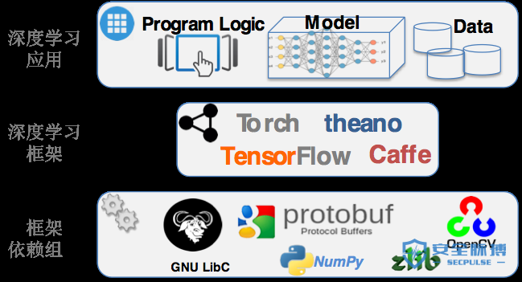

# AI安全风险白皮书
360 安全研究院在过去一年里对深度学习系统的安全性做了详细的研究。 我们通过这个文档对这些工作做了一个系统的总结。 AI系统的安全问题主要包括模型安全、数据安全以及代码安全。 本文以目前流行的图像识别AI系统为例，介绍AI系统在这些方面面临的安全威胁。对于这些威胁造成的影响，我们关注传统的攻击类型，包括恶意输入导致的拒绝服务，信息泄露，系统劫持。 同时我们也关注AI系统特有的安全问题，例如逃逸攻击，数据污染攻击。
关于AI系统的安全威胁，本文从以下三个角度进行阐述。第一部分描述深度学习系统软件实现的复杂度，以及软件实现带来的安全漏洞。第二部分描述针对深度学习系统模型的逃逸攻击。 第三部分揭示深度学习系统数据流中的安全威胁，以及相应的降维攻击展示。 白皮书主要内容参照了360安全团队近期发布的AI安全相关报告。
## I.深度学习软件实现中的安全问题 
人工智能应用面临来自多个方面的威胁：包括深度学习框架中的软件实现漏洞、对抗机器学习的恶意样本生成、训练数据的污染等等。 这些威胁可能导致人工智能所驱动的识别系统出现混乱，形成漏判或者误判，甚至导致系统崩溃或被劫持，并可以使智能设备变成僵尸攻击工具。

在推进人工智能应用的同时，我们迫切需要关注并解决这些安全问题。本章首先介绍我们在深度学习框架中发现的安全问题。

### 1. 人工智能讨论中的安全盲点
目前公众对人工智能的关注，尤其是深度学习方面， 缺少对安全的考虑。我们把这个现象称为人工智能的安全盲点。 导致这个盲点的主要原因是由于算法与实现的距离。 近期对于深度学习的讨论主要停留在算法和前景展望的层面，对应用场景和程序输入有很多假设。

受到关注的应用往往假定处于善意的或封闭的场景。例如高准确率的语音识别中的输入都是自然采集而成，图片识别中的输入也都来自正常拍摄的照片。这些讨论没有考虑人为恶意构造或合成的场景。

人工智能讨论中的安全盲点可以通过最典型的手写数字识别案例来说明。基于MNIST数据集的手写数字识别应用是深度学习的一个非常典型的例子， 最新的深度学习教程几乎都采用这个应用作为实例演示。在这些教程中（如下图所示）算法层的讨论所考虑的分类结果只关心特定类别的近似度和置信概率区间。算法层的讨论没有考虑输入会导致程序崩溃甚至被攻击者劫持控制流。这其中被忽略掉的输出结果反映出算法和实现上考虑问题的差距，也就是目前人工智能讨论中的安全盲点。

现实中的开放应用需要处理的输入不仅来源于正常用户，也可以是来自黑产等恶意用户。 人工智能的应用必须考虑到应用所面临的现实威胁。程序设计人员需要考虑输入数据是否可控，监测程序是否正常执行，并验证程序执行结果是否真实反映应用的本来目的。

### 2. 深度学习系统的实现及依赖复杂度
深度学习软件很多是实现在深度学习框架上。目前基于深度学习系统框架非常多，主流的包括TensorFlow、Torch，以及Caffe 等。

深度学习框架的使用可以让应用开发人员无需关心神经元网络分层以及培训分类的实现细节，更多关注应用本身的业务逻辑。 开发人员可以在框架上直接构建自己的神经元网络模型，并利用框架提供的接口对模型进行训练。这些框架简化了深度学习应用的设计和开发难度，一个深度学习的模型可以用几十行代码就可以写出来。

深度学习框架掩盖了它所使用的组件依赖，同时也隐藏了系统的复杂程度。 每种深度学习框架又都是实现在众多基础库和组件之上，很多深度学习框架里还包括图像处理、矩阵计算、数据处理、GPU加速等功能。 图2展示了典型的深度学习应用组件和它们的依赖关系。例如Caffe除了自身神经元网络模块实现以外，还包括137个第三方动态库，例如libprotobuf, libopencv, libz 等。 谷歌的TensorFlow 框架也包含对多达97个python模块的依赖，包括librosa,numpy 等。

系统越复杂，就越有可能包含安全隐患。任何在深度学习框架以及它所依赖的组件中的安全问题都会威胁到框架之上的应用系统。另外模块往往来自不同的开发者，对模块间的接口经常有不同的理解。当这种不一致导致安全问题时，模块开发者甚至会认为是其它模块调用不符合规范而不是自己的问题。在我们的发现的导致深度学习框架崩溃的漏洞中就遇到过这种情况。

### 3. 深度学习软件实现细节中的安全问题
正如安全人员常说的， 魔鬼隐藏于细节之中 （The Devil is In the Detail）。任何一个大型软件系统都会有实现漏洞。 考虑到深度学习框架的复杂性， 深度学习应用也不例外。

360 Team Seri0us 团队在一个月的时间里面发现了数十个深度学习框架及其依赖库中的软件漏洞。发现的漏洞包括了几乎所有常见的类型，例如内存访问越界，空指针引用，整数溢出，除零异常等。 这些漏洞潜在带来的危害可以导致对深度学习应用的拒绝服务攻击，控制流劫持，分类逃逸，以及潜在的数据污染攻击。

以下我们通过两个简单的例子来介绍深度学习框架中的漏洞以及对应用的影响。两个例子都来源于框架的依赖库，一个是TensorFlow框架所依赖的numpy包，另一个是Caffe在处理图像识别所使用的libjasper库。

- **案例1： 对基于TensorFlow的语音识别应用进行拒绝服务攻击**

案例中的 numpy 是TensorFlow所依赖的一个负责科学计算的python库。TensorFlow的很多应用在进行矩阵运算的时候都会用的它。 我们在这个库里发现一个简单逻辑漏洞（CVE-2017-12852）。 这个问题的简单情况如下图所示，它是发生在numpy中的pad函数。 在pad函数中，存在这样一个while循环，循环结束需要使 pad_before>safe_pad和pad_after>safe_pad同时不成立， 而在我们构造的例子中，可以使得pad_before和 pad_after不断的增大，而safe_pad不断的减小，使得循环始终无法结束，从而导致拒绝服务。