# 我的AI安全检测学习笔记（一）

[原文地址](https://www.secpulse.com/archives/74179.html)

## 0x01 前言
前段时间看了[碳基体](http://tanjiti.lofter.com/tag/%E5%A4%A7%E6%95%B0%E6%8D%AE%E5%AE%89%E5%85%A8)和[Webber](http://www.webber-guo.com/)等大佬的几篇大数据安全的文章，学到了很多，现在做个总结。
个人觉得在大数据安全领域中，基于大数据的AI安全检测平台可以算是大数据安全的主流系统（因为统计分析也占了一部分）。

整体的架构如下图所示：
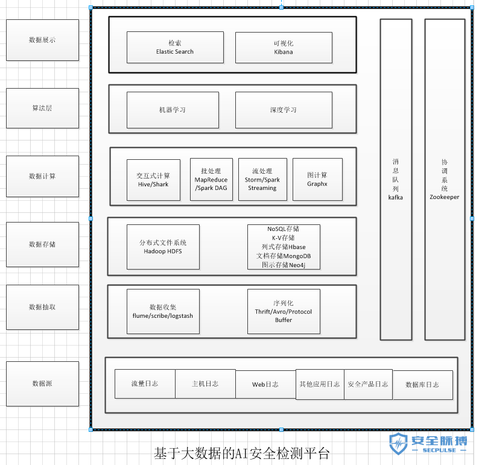

其中大数据技术是基础，AI（包括但不限于机器学习、深度学习算法）是引擎，安全是目的。
一开始，因为出于学术研究的目的，没有考虑到实际效用，我关注的重心基本都在跑模型调算法，想尽量选取最优的算法，感觉都要偏离安全路线走到算法领域这块了；

后来到小规模部署测试时，觉得算法都是其次，**核心的关注点应该是对数据的理解和要解决的安全问题，应该是实际中遇到的安全难题驱使我们使用AI安全检测，获取到的真实数据驱动AI安全检测**；

再到后来，考虑到如果真正部署在互联网级别的环境中，那么之前我们关注的重点就没那么重点了，什么算法啊，数据啊，安全问题啊，关注的优先级都没那么高了，**在互联网级的数据中，最重要的是系统，系统，系统，对底层数据理解，对商业目标清楚。**
帽子盖的很大，是为了对大数据安全及系统以及AI安全检测平台及部署有个宏观的认识。

但是此篇文章本意上是从微观上讲述AI安全检测中的算法层，即模型训练部分，**从分布式数据源的收集，到数据的清洗，再到数据的训练，偏细节**，其中穿插着各种图示，以直观的显示数据之间的联系，最终训练好的模型可以作为AI安全检测平台的检测引擎。

## 0x02 模型训练“一把梭”
之前做过的一些机器学习+安全的模型训练都比较简单和单一，而且都没有“一把梭”处理，有的用的是别人收集好的训练集和测试集，有的用的是别人已经向量化的数据集，有的用的是安全专家已经制定好的数据集的特征集合，有的没有可视化对比分析各种模型的性能，等等，有许多不足之处。现在选取web参数安全检测的场景，把模型训练的一整套处理流程总结如下：
- 1）数据收集
- 2）数据清洗
- 3）特征工程
- 4）训练模型
- 5）模型性能评估

### 1）数据收集

考虑到要解决的安全问题是Web参数安全检测，我想到两种解决方案，一种是单分类的方法，“非白即黑”，这种方法只需要收集大量的白样本，也就是大量正常的payload，对正常参数建模即可；

另一种方法就是简单的二分类和多类分类，需要收集大量的黑白样本，即正常和异常payload（个人觉得不太容易区分异常检测和攻击检测）。单分类的方法处理起来局限性很多，所以采用了比较简单的第二种方法，那么我们需要收集正常和异常的web参数的payload。这个步骤可以叫做“定界”，即提出问题，确定范围。
收集数据是体力活，SQLi、XSS、本地文件包含、远程文件包含、敏感文件访问等等各式各样的攻击的payload五花八门，很难全面收集，而SQLi、XSS、Shell Command这三种攻击占了web攻击中的绝大部分，所以我们主要收集了这三种攻击的payload。

数据的来源主要是Github、Secrepo和一些开源的数据集，比如CSIC2010。从github上收集SQLi、XSS、Shell Command的payload；从secrepo上的fwaf项目中下载了正常的payload，也从CSIC2010数据集中下载了正常的payload。因为我们要做的是web参数安全检测，之前下载得到的一些数据是完整的url或是完整的web数据包，所以需要写脚本处理一下，把之前得到的所有payload的格式统一为参数型payload，先存储到txt中，得到SQLCollection.txt、XSSCollection.txt、ShellCollection.txt和non-malicousCollection.txt等文本。以CSIC2010数据集为例，原始正常数据集样例为：

```
POST http://localhost:8080/tienda1/publico/anadir.jsp HTTP/1.1
User-Agent: Mozilla/5.0 (compatible; Konqueror/3.5; Linux) KHTML/3.5.8 (like Gecko)
Pragma: no-cache
Cache-control: no-cache
Accept: text/xml,application/xml,application/xhtml+xml,text/html;q=0.9,text/plain;q=0.8,image/png,*/*;q=0.5
Accept-Encoding: x-gzip, x-deflate, gzip, deflate
Accept-Charset: utf-8, utf-8;q=0.5, *;q=0.5
Accept-Language: en
Host: localhost:8080
Cookie: JSESSIONID=AE29AEEBDE479D5E1A18B4108C8E3CE0
Content-Type: application/x-www-form-urlencoded
Connection: close
Content-Length: 146
 
id=2&nombre=Jam%F3n+Ib%E9rico&precio=85&cantidad=%27%3B+DROP+TABLE+usuarios%3B+SELECT+*+FROM+datos+WHERE
```

经过下面脚本处理后

```python
import numpy as np
import pandas as pd
import csv
 
def from_CSIC2010_to_collection(src_file, dest_file):
    payloads = []
    payload_next_line = False
    with open("{}".format(src_file)) as f:
        for line in f.readlines():
            if line.startswith('GET') and len(line.split('?')) > 1:
                total_payload = (line.split('?')[1]).split(' ')[0]
                inputs = total_payload.split('&')
                payloads = payloads + [input.split('=')[1] for input in inputs if len(input.split('=')) > 1]
            if line.startswith('Content-Length'):
                payload_next_line = True
            elif payload_next_line and len(line) > 2:
                inputs = line.split('&')
                payloads = payloads + [input.split('=')[1].strip('\n') for input in inputs if len(input.split('=')) > 1]
                payload_next_line = False
       
    payloads = list(set(payloads))
    with open("{}".format(dest_file), "a") as myfile:
        for payload in payloads:
            if payload != '':
                myfile.write('{}\n'.format(payload))
 
    print('Total number of data points gathered: ' + str(len(payloads)))
    
from_CSIC2010_to_collection('normalTrafficTraining.txt','non-maliciousCollection.txt')
from_CSIC2010_to_collection('normalTrafficTest.txt','non-maliciousCollection.txt')import nu
```

处理后的正常的参数型payload样例如下：

```
stormy

amontona%2Br

dre

Plebs+Cadevall

kouraviev%40socimi.com.gl

C%2F+Galvan+98+10%3FA

cuboides

conTRaRioSa

Amaranta

Anan%EDas

1646619450025550

Villanueva+Gualano
```

### 2）数据清洗

先将数据采集得到的SQLCollection.txt等多个文本文件中的payload转化为pandas中的DataFrame类型并打标再合并为一个DataFrame

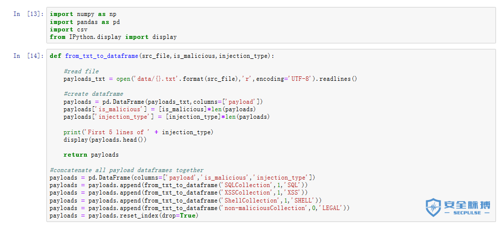

输出结果为：

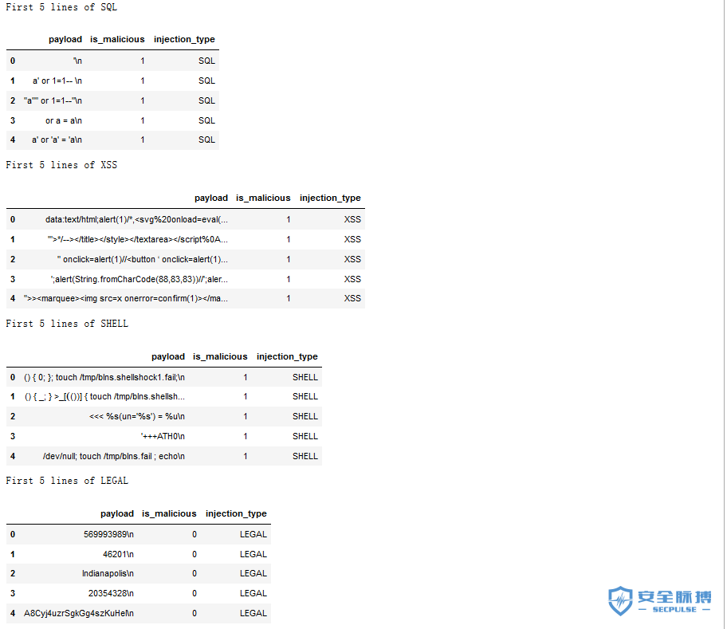

再进行数据清洗，包括移除payload中结尾的“\n”,去重，去空，移除长度为1的异常payload，打乱整个数据集，存储为csv文件。

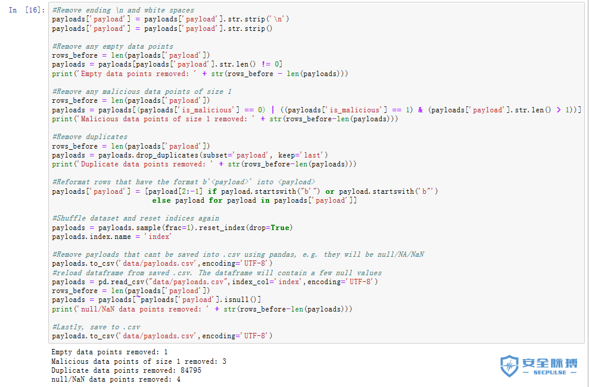

### 3）特征工程

针对机器学习（当然，深度学习可以表征学习，自动化构建特征，如果延伸的话会复杂很多，所以这里暂不考虑深度学习），想到两种特征工程方法，一种是利用安全领域知识提取多个单个特征，构成特征集合；

另一种是使用词向量模型。两种特征方法都比较简单，都可以处理数据集得到向量化数据作为机器学习算法的输入。
#### 3a）多个单个特征：
对比观察黑白样本参数型payload，因为参数型payload较短小，也没什么明显的区分度，可以直接获取的信息有限，所以能想到的特征有：长度、标点符号的数目、最小比特值、最大比特值、平均比特值、互不相同比特值的数目等10个特征。但是现在还不能确定每个特征对最后分类结果的区分度高低。所以下面使用matplotlib作图看看各个特征的区分度，以payload的长度为例

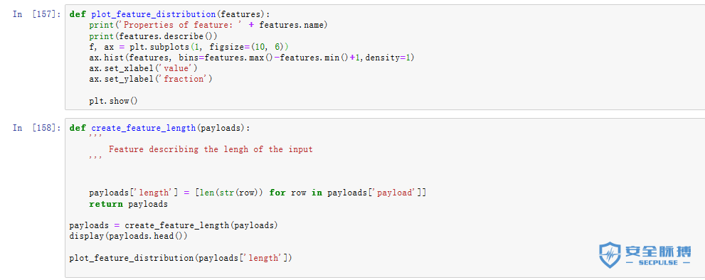

输出结果为：


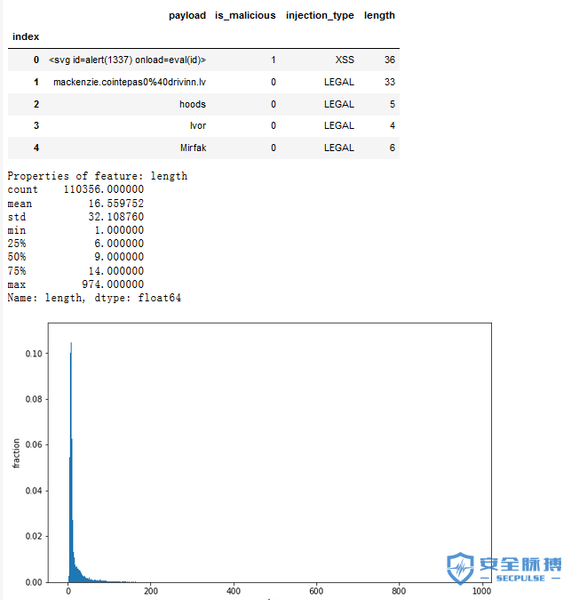


可以看到特征length的区分度还可以，同理可以先简单看一下其他特征的区分度，但是这种方法还不能区分各个特征的重要性，使用SelectKBest做单机特征工程，可以给每个特征打分，从而判断特征的优劣，进行特征选取。

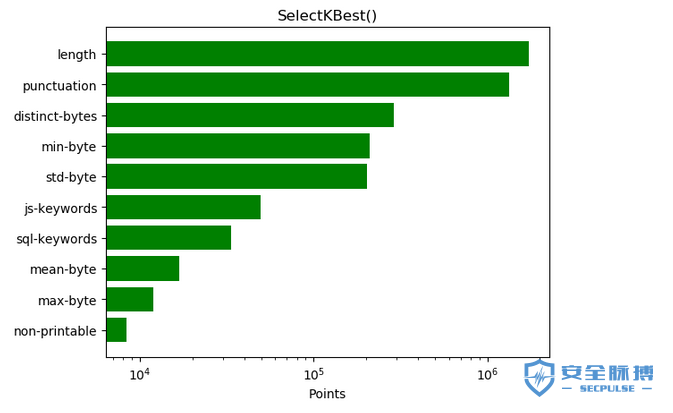

可以看到区分度比较高的前四个特征分别是：length、puncuation、distinct-bytes、min-byte。这对4）模型训练可能会有用，因为选取的10个特征不一定要全部用到，如果选取4个特征训练的模型性能和选取10个特征训练的模型性能相差无几，那前者更优。
#### 3b）词向量模型：
对payload的文本特征提取属于NLP技术领域，主要有词集模型、词袋模型、TFIDF模型，这里使用词袋模型CountVectorizer和TFIDF模型TfidfVectorizer，配合N-Grams语言模型使用，这里以1-grams为例：

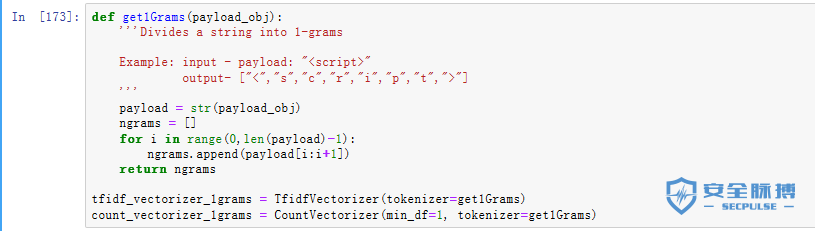

经过此步骤处理得到的向量维度一定会很大，所以为了可视化观察特征集合的区分度，需要降维至二维，在平面直角坐标系中观察特征集合对类别的区分度。

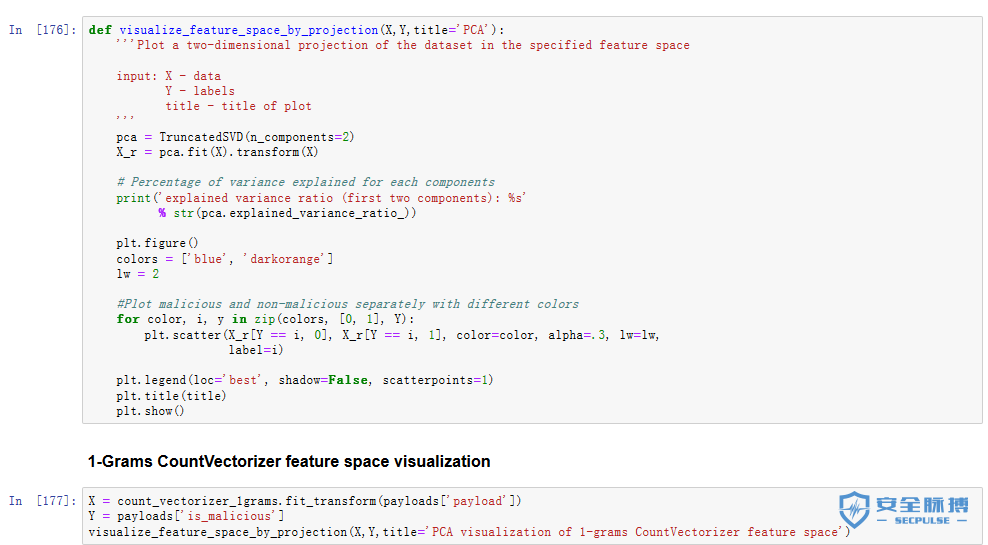

输出结果为

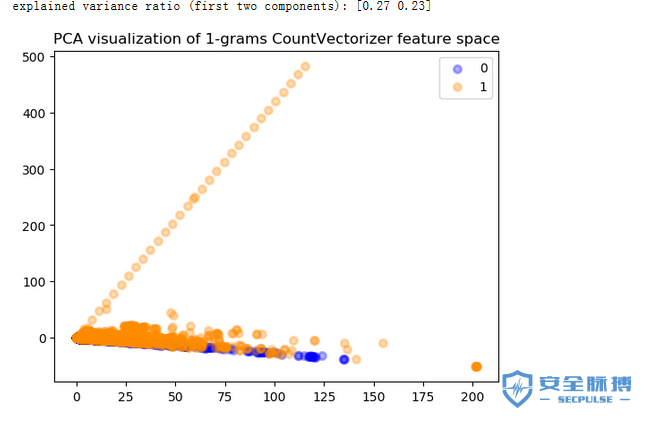

可以看到区分度较明显。同理可以可视化2-grams，3-grams观察并使用。

### 4）训练模型

以3）特征工程中两种特征工程方法为基础，采用多种机器学习算法和两种调参方法，再结合Pipeline，训练模型。这里用的机器学习算法主要有AdaBoost、SGD、MLP、LR、SVM、RF、DT、NB；两种调参方法为RandomizedSearchCV和GridSearchCV，前者是随机搜索，后者是网格搜索；Pipeline主要进行流式化封装管理，这里结合词向量模型，可以很好的解决CountVectorizer和TfidfVectorizer类可能遇到的vocabulary的问题。采用第一种特征工程方法跑出的部分模型结果如下图：

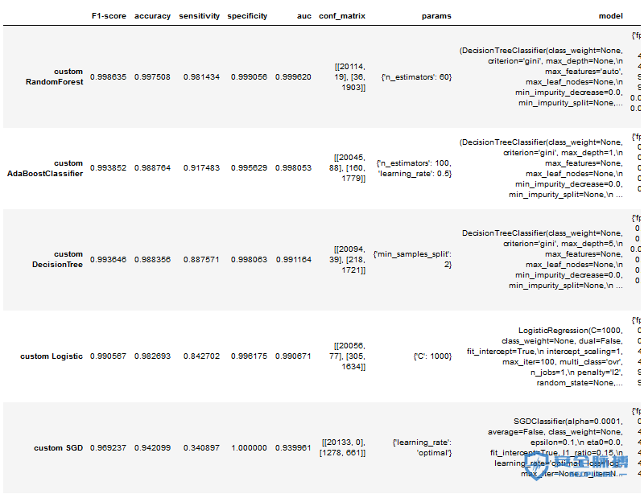

### 5）模型性能评估

绘制ROC曲线，以F1-score为评价标准评估所有模型性能，得到排名前十的模型，如下表所示：

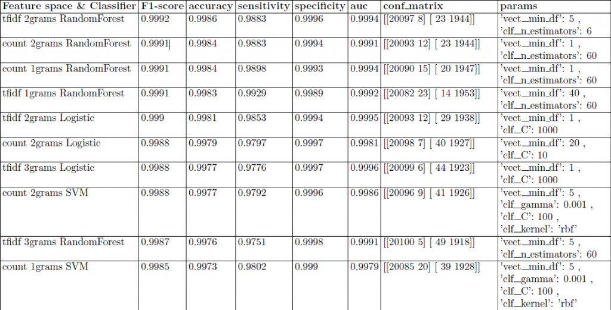

最终确定2-grams+TFIDF+RandomForest性能最优。F1-score：0.9992 accuracy：0.9986 sensitivity：0.9883 specificity：0.9996 AUC：0.9994
再一次证明2-grams+tfidf+随机森林是机器学习的标配（不考虑深度学习和模型融合，此处模型融合应该不会有明显性能提升）。

## 0x03 应用场景以及想法

虽然上面只是一个简单的AI安全检测，但这是基础不是吗（逃）。以上可以看做一个AI安全检测基分类器，在此之上可以进行一些有意思的研究。比如对未知攻击的分析检测，作了个图:

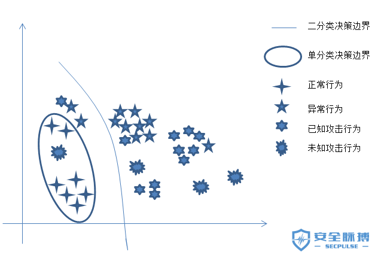

思路：
一、基异常检测分类器：1.方法：1）单分类，用正常判定异常，2）二分类，判定相对异常/部分异常。2.依据:正常的总是千篇一律，异常的相对正常来说各不相同
二、攻击检测分类器：根据一定程度上已知攻击的相似性，未知攻击相对来说各不相同，使用聚类算法对异常聚类，区分正常的异常、已知攻击、相对未知的攻击
三、深度学习进行未知攻击分析检测：作了一个很不负责的图

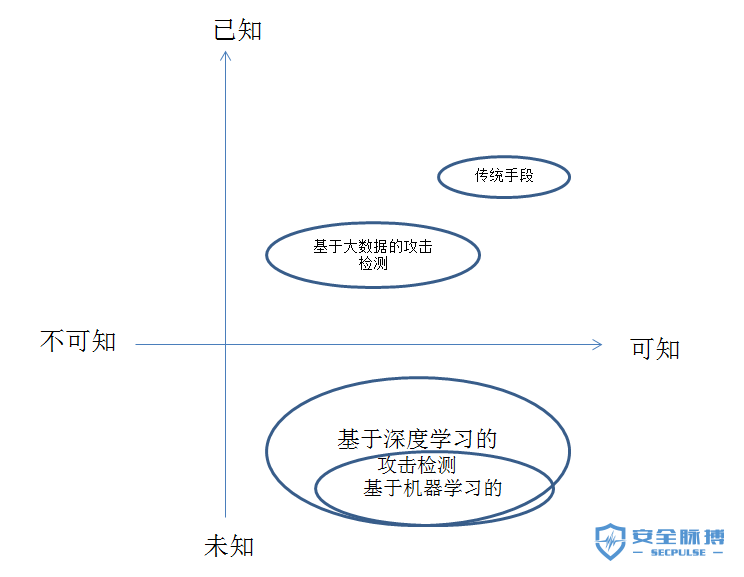


传统的手段和一般的大数据分析较难检测未知攻击，机器学习对未知攻击有一定的检测能力，深度学习较机器学习而言，提高了检测效率，降低了误报率，摆脱了对特征工程的依赖，能够自动化智能化识别攻击特征，有助于发现潜在安全威胁

## 0x04 Next

要做的还有很多，从小到大来说：
方向1：算法层面：增加单分类算法、聚类算法、深度学习算法
方向2：模型训练层面：将模型训练这部分从分布式数据源的数据采集到清洗再到训练，框架化、自动化，节省算法工程师的操作
方向3：ELK等底层框架搭建，在此之上，将模型部署为检测引擎
方向4：考虑互联网级数据下，系统的鲁棒性和商业性

## 0x05 参考
- http://tanjiti.lofter.com/tag/%E5%A4%A7%E6%95%B0%E6%8D%AE%E5%AE%89%E5%85%A8
- https://github.com/grananqvist/Machine-Learning-Web-Application-Firewall-and-Dataset
- https://www.zhihu.com/question/286925266/answer/453168649
- https://www.cnblogs.com/jasonfreak/p/5448385.html
- https://stackoverflow.com/questions/49806790/iterable-over-raw-text-documents-expected-string-object-received
- https://raw.githubusercontent.com/faizann24/Fwaf-Machine-Learning-driven-Web-Application-Firewall/
- https://www.cnblogs.com/focusonepoint/p/5838768.html
- http://www.freebuf.com/column/167084.html